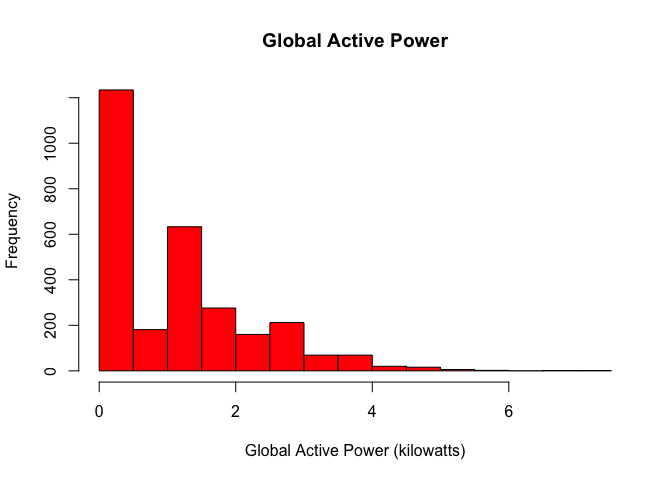
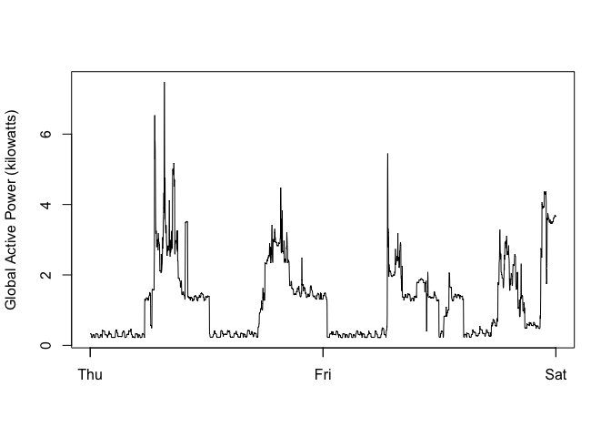
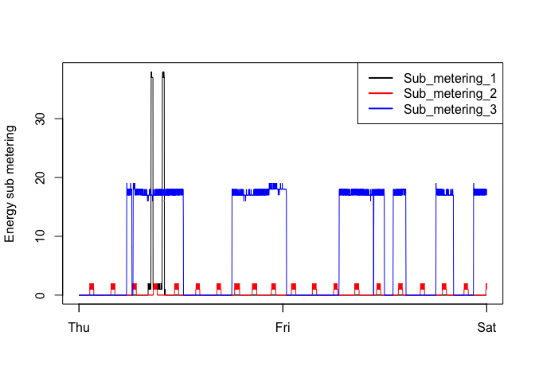
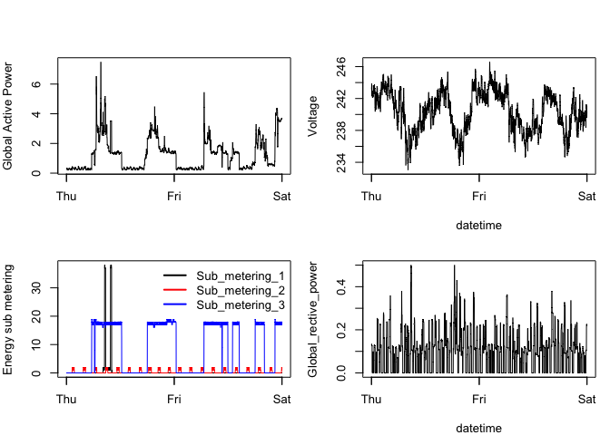

set the present working directory

    setwd("/Users/zliu11/R_for_DScourses/Course4.ExpDataAnalysis/week1project/Repo_for_wk1_proj")

load library

    library(data.table)

download the data file and unzip it to the same folder

    dataUrl = "https://d396qusza40orc.cloudfront.net/exdata%2Fdata%2Fhousehold_power_consumption.zip"
    download.file(dataUrl, destfile = "elec_power_consumption.zip", method = "curl")
    unzip("elec_power_consumption.zip")

read data spanning 1/2/2007 to 2/2/2007 to the data table called "dt"
while keeping the original column names

    dt <- fread("household_power_consumption.txt", skip = "1/2/2007", nrows = 2880, col.names = colnames(fread("household_power_consumption.txt", nrows = 1)))

    dt

    ##           Date     Time Global_active_power Global_reactive_power Voltage
    ##    1: 1/2/2007 00:00:00               0.326                 0.128  243.15
    ##    2: 1/2/2007 00:01:00               0.326                 0.130  243.32
    ##    3: 1/2/2007 00:02:00               0.324                 0.132  243.51
    ##    4: 1/2/2007 00:03:00               0.324                 0.134  243.90
    ##    5: 1/2/2007 00:04:00               0.322                 0.130  243.16
    ##   ---                                                                    
    ## 2876: 2/2/2007 23:55:00               3.696                 0.226  240.90
    ## 2877: 2/2/2007 23:56:00               3.698                 0.226  241.02
    ## 2878: 2/2/2007 23:57:00               3.684                 0.224  240.48
    ## 2879: 2/2/2007 23:58:00               3.658                 0.220  239.61
    ## 2880: 2/2/2007 23:59:00               3.680                 0.224  240.37
    ##       Global_intensity Sub_metering_1 Sub_metering_2 Sub_metering_3
    ##    1:              1.4              0              0              0
    ##    2:              1.4              0              0              0
    ##    3:              1.4              0              0              0
    ##    4:              1.4              0              0              0
    ##    5:              1.4              0              0              0
    ##   ---                                                              
    ## 2876:             15.2              0              1             18
    ## 2877:             15.2              0              2             18
    ## 2878:             15.2              0              1             18
    ## 2879:             15.2              0              1             17
    ## 2880:             15.2              0              2             18

Combine date and time to generate another column, then convert them into
date/time class

    dt[, date.time := paste(dt$Date, dt$Time, sep = " ")]
    DateTime <- dt$date.time
    DateTime <- as.POSIXct(DateTime, format = "%d/%m/%Y %H:%M:%S")
    dt$date.time <- DateTime

plot1
=====

    hist(dt$Global_active_power, main = "Global Active Power", xlab = "Global Active Power (kilowatts)", col = "red")

    dev.copy(png, file = "plot1.png")

    ## quartz_off_screen 
    ##                 3

    dev.off()

    ## quartz_off_screen 
    ##                 2

plot2
=====

    with(dt, {plot(Global_active_power ~ date.time, type = "l", ylab = "Global Active Power (kilowatts)", xlab="")})

    dev.copy(png, file = "plot2.png")

    ## quartz_off_screen 
    ##                 3

    dev.off()

    ## quartz_off_screen 
    ##                 2

plot3
=====

    with(dt, {plot(Sub_metering_1 ~ date.time, type = "l", ylab = "Energy sub metering", xlab = "") 
            lines(Sub_metering_2 ~ date.time, col = "red")
            lines(Sub_metering_3 ~ date.time, col = "blue")
    })

    legend("topright", col = c("black", "red", "blue"), lty = 1, lwd = 2, legend = c("Sub_metering_1", "Sub_metering_2", "Sub_metering_3"))

    dev.copy(png, file = "plot3.png")

    ## quartz_off_screen 
    ##                 3

    dev.off()

    ## quartz_off_screen 
    ##                 2

plot4
=====

    par(mfrow=c(2,2), mar=c(4,4,2,1), oma=c(0,0,2,0))
    with(dt, {
      plot(Global_active_power~date.time, type="l", 
           ylab="Global Active Power", xlab="")
      plot(Voltage~date.time, type="l", 
           ylab="Voltage", xlab = "datetime")
      plot(Sub_metering_1~date.time, type="l", 
           ylab="Energy sub metering", xlab="")
      lines(Sub_metering_2~date.time,col='red')
      lines(Sub_metering_3~date.time,col='blue')
      legend("topright", col=c("black", "red", "blue"), lty=1, lwd=2, bty="n",
             legend=c("Sub_metering_1", "Sub_metering_2", "Sub_metering_3"))
      plot(Global_reactive_power~date.time, type="l", 
           ylab="Global_rective_power",xlab="datetime")
    })

    dev.copy(png, file = "plot4.png")

    ## quartz_off_screen 
    ##                 3

    dev.off()

    ## quartz_off_screen 
    ##                 2
